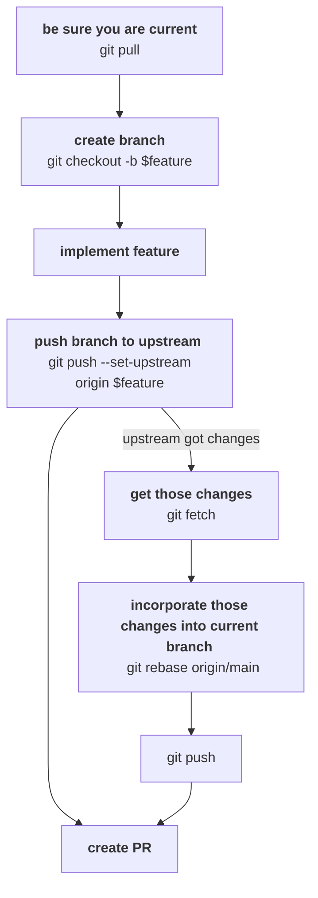

# git flow

## summary

```sh
git pull
git checkout -b $feature
# implement feature
git push --set-upstream origin $feature
# other changes happen in 'main' in the meanwhile
git fetch
git rebase origin/main
# fix conflicts if any
# finish implementing feature
git push
git rebase --autostash --interactive
# create PR
```

## explanation

It is more easy to do code review code and archaeology when...
- History is clean
- Each commit is self-contained
- There are no merge commits

The summary above shows the sort of git flow that helps with such hygiene.

What this also means is avoiding merging any branch to any other,
typically main to feature branch, and later, feature to main branch.

### `git rebase origin/main`

This command re-orders commits in current branch on top of main branch,
which has the effect of making it look like the branch was newly-created
It brings in all changes coming in from main,
without a need to merge or cherry-pick.

### `git rebase --autostash --interactive`

This lets you re-order (unpushed) commits as appropriate.
A typical change is fixing something that should ideally have been part on an older commit,
in which case you would do a "fix" commit,
then use the command to fuse it onto that older commit.

## some final thoughts

- When the PR is ready to review,
  avoid modifying history (`git rebase`),
  except when all review comments have been addressed.
  This helps ease review by...
  - Preserving old comments
  - Allowing reviewers the ability to see smaller commits
   (instead of trying to determine which parts have changed since previous reviews)
- Avoid squash merge functionality of GitHub,
  unless the PR consists of a single commit.
  This is something that can be disabled using GitHub settings of the repo.
  Squashing results in lost history,
  making it more hard to do archaeology.

## visualising it

Following is an incomplete flow of above:


